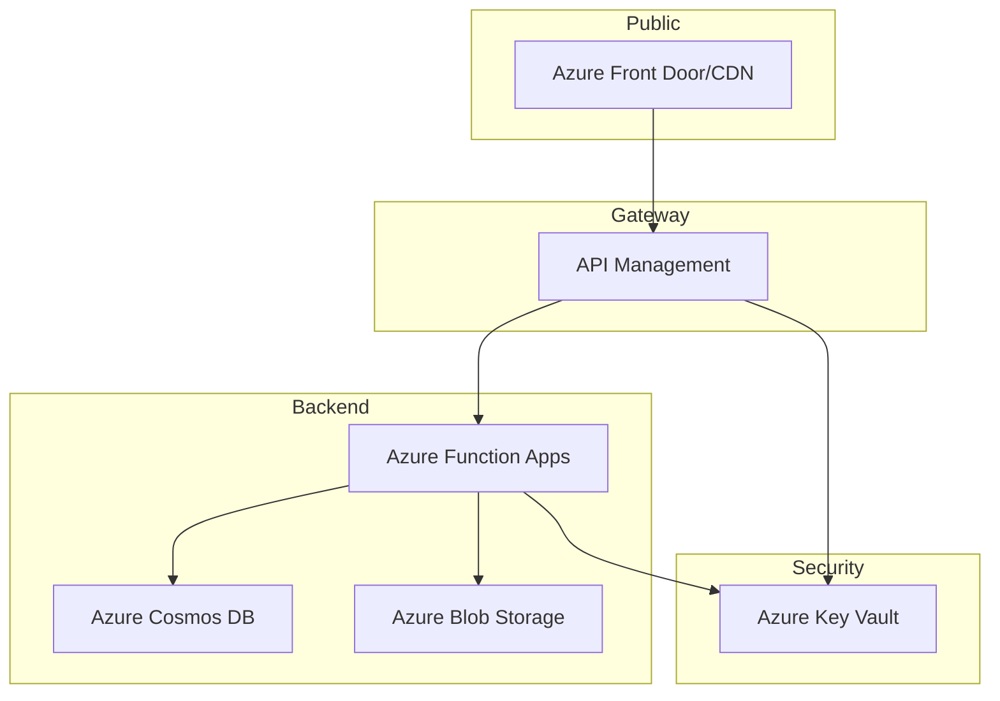

# Unified Domain Architecture (Azure)

## Overview
This document describes the unified domain architecture for the KainosStudio platform on Azure, focusing on secure, scalable, and maintainable patterns. It replaces legacy Application Gateway and connection string patterns with Azure Front Door/CDN, API Management, RBAC, and managed identities.

---

## Entry Points
- **Azure Front Door/CDN**: Main public entry for all HTTP(S) traffic. Handles routing, caching, SSL termination, and WAF.
- **Azure API Management**: API gateway for backend services, providing security, rate limiting, and transformation.

---

## Architecture Diagram

---

## Key Components

### 1. Azure Front Door/CDN
- **Purpose**: Global entry point, SSL offload, WAF, caching, routing to API Management and static assets.
- **Configuration**:
  - Routes `/api/*` to API Management
  - Routes `/static/*` to Blob Storage
  - WAF enabled
  - Custom domains supported

### 2. Azure API Management
- **Purpose**: API gateway for backend services
- **Configuration**:
  - Integrates with Function Apps via HTTP backend
  - Policies for authentication, rate limiting, transformation
  - RBAC for admin and developer access

### 3. Azure Function Apps
- **Purpose**: Serverless compute for API endpoints
- **Configuration**:
  - Managed identity enabled
  - Accesses Cosmos DB, Blob Storage, Key Vault via RBAC

### 4. Azure Cosmos DB
- **Purpose**: NoSQL database for application data
- **Configuration**:
  - Access via managed identity
  - No connection strings in code

### 5. Azure Blob Storage
- **Purpose**: Static asset hosting
- **Configuration**:
  - Access via managed identity
  - CDN integration for global delivery

### 6. Azure Key Vault
- **Purpose**: Secrets and key management
- **Configuration**:
  - RBAC only (no access policies)
  - Managed identity access for Function Apps and API Management

---

## Security Model
- **RBAC Everywhere**: All resources use Azure RBAC for access control
- **Managed Identities**: No secrets in code; all access via managed identities
- **No Legacy Access Policies**: Key Vault and other resources do not use access policies
- **WAF**: Web Application Firewall enabled at Front Door/CDN

---

## Routing Patterns
- `/api/*` → API Management → Function Apps
- `/static/*` → Blob Storage (via CDN)
- Custom domains supported via Front Door/CDN

---

## Terraform Patterns
- Use direct resource references (no legacy modules)
- Managed identity blocks for all compute resources
- RBAC role assignments for Key Vault, Cosmos DB, Blob Storage
- Outputs reference direct resources

---

## Migration Notes
- **Removed**: Application Gateway, legacy connection strings, Key Vault access policies
- **Added**: Front Door/CDN, API Management, RBAC, managed identities
- **Documentation**: All references updated to reflect new architecture

---

## References
- [CDN Architecture Analysis](./CDN_ARCHITECTURE_ANALYSIS.md)
- [Security Best Practices](./SECURITY_BEST_PRACTICES.md)
- [Testing](./TESTING.md)

---

## Change Log
- 2025-08-15: Migrated to unified domain architecture with Front Door/CDN and API Management. Removed Application Gateway and legacy patterns.
