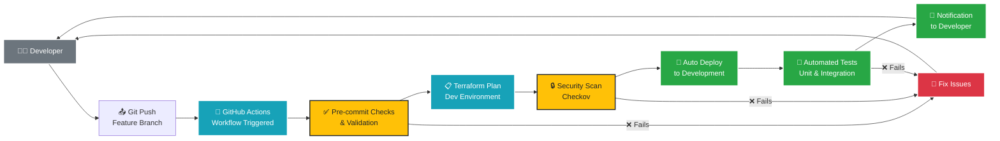

# Development Environment - Deployment Flow

## Development Deployment Characteristics

### Trigger Conditions
- **Event**: Push to any feature branch
- **Frequency**: On every commit
- **Approval**: None required

### Workflow Steps

1. **Code Push**: Developer pushes changes to feature branch
2. **Workflow Trigger**: GitHub Actions automatically starts
3. **Pre-commit Validation**: 
   - Code formatting checks
   - Terraform syntax validation
   - Basic linting
4. **Terraform Plan**: Generate infrastructure changes preview
5. **Security Scan**: Checkov security analysis
6. **Auto Deployment**: Deploy to development environment
7. **Testing**: Run automated test suite
8. **Notification**: Inform developer of results

### Environment Characteristics

| Aspect | Configuration |
|--------|---------------|
| **Infrastructure** | Minimal resources for cost efficiency |
| **Monitoring** | Basic logging and metrics |
| **Security** | Standard encryption, basic access controls |
| **Availability** | Single AZ, no redundancy |
| **Data Retention** | 7-30 days |

### Success Criteria
- ✅ All validation checks pass
- ✅ Security scan shows no critical issues
- ✅ Deployment completes successfully
- ✅ Basic functionality tests pass
- ✅ Developer receives success notification

### Failure Handling
- ❌ Immediate notification to developer
- 🔧 Automatic rollback if deployment fails
- 📝 Detailed error logs provided
- 🔄 Easy re-trigger after fixes
