# Kainos Studio - High-Level Architecture

```mermaid
graph TB
    %% External Users
    Users[👥 End Users]
    
    %% GitHub CI/CD
    GitHub[🔄 GitHub Actions<br/>CI/CD Pipeline]
    
    %% AWS Infrastructure
    subgraph AWS["☁️ AWS Infrastructure"]
        direction TB
        subgraph AWSCompute["Compute Layer"]
            LambdaCore[⚡ Lambda<br/>Core Application]
            LambdaKFDApi[⚡ Lambda<br/>KFD API Handler]
        end
        
        subgraph AWSStorage["Storage Layer"]
            S3KFD[🗄️ S3<br/>KFD Files]
            S3Forms[🗄️ S3<br/>Form Files]
            DynamoDB[🗃️ DynamoDB<br/>Sessions]
        end
        
        subgraph AWSMonitoring["Monitoring"]
            CloudWatch[📊 CloudWatch<br/>Logs & Metrics]
        end
        
        subgraph AWSSecurity["Security"]
            KMS[🔐 KMS<br/>Encryption]
            Secrets[🔑 Secrets Manager]
        end
    end
    
    %% Azure Infrastructure
    subgraph Azure["☁️ Azure Infrastructure"]
        direction TB
        subgraph AzureCompute["Compute Layer"]
            FunctionCore[⚡ Function App<br/>Core Application]
            FunctionUpload[⚡ Function App<br/>Upload Handler]
        end
        
        subgraph AzureStorage["Storage Layer"]
            StorageKFD[🗄️ Storage Account<br/>KFD Files]
            StorageForms[🗄️ Storage Account<br/>Form Files]
            CosmosDB[🗃️ Cosmos DB<br/>Sessions]
        end
        
        subgraph AzureMonitoring["Monitoring"]
            AppInsights[📊 Application Insights<br/>Monitoring]
        end
        
        subgraph AzureSecurity["Security"]
            KeyVault[🔐 Key Vault<br/>Secrets & Keys]
        end
    end
    
    %% Connections
    Users --> LambdaCore
    Users --> FunctionCore
    
    GitHub --> AWS
    GitHub --> Azure
    
    LambdaCore --> S3KFD
    LambdaCore --> S3Forms
    LambdaCore --> DynamoDB
    LambdaKFDApi --> S3KFD
    
    FunctionCore --> StorageKFD
    FunctionCore --> StorageForms
    FunctionCore --> CosmosDB
    FunctionUpload --> StorageKFD
    
    %% Monitoring connections
    LambdaCore -.-> CloudWatch
    LambdaKFDApi -.-> CloudWatch
    FunctionCore -.-> AppInsights
    FunctionUpload -.-> AppInsights
    
    %% Security connections
    LambdaCore -.-> KMS
    LambdaCore -.-> Secrets
    FunctionCore -.-> KeyVault
    
    %% Styling
    classDef aws fill:#FF9900,stroke:#232F3E,stroke-width:2px,color:#fff
    classDef azure fill:#0078D4,stroke:#fff,stroke-width:2px,color:#fff
    classDef app fill:#28A745,stroke:#fff,stroke-width:2px,color:#fff
    classDef external fill:#6C757D,stroke:#fff,stroke-width:2px,color:#fff
    
    class AWS,AWSCompute,AWSStorage,AWSMonitoring,AWSSecurity,LambdaCore,LambdaKFDApi,S3KFD,S3Forms,DynamoDB,CloudWatch,KMS,Secrets aws
    class Azure,AzureCompute,AzureStorage,AzureMonitoring,AzureSecurity,FunctionCore,FunctionUpload,StorageKFD,StorageForms,CosmosDB,AppInsights,KeyVault azure
    class Users,GitHub external
```

## Architecture Overview

### Multi-Cloud Design
The Kainos Studio infrastructure supports deployment to both AWS and Azure, providing flexibility and avoiding vendor lock-in.

### Core Components

#### Compute Layer
- **AWS**: Lambda functions for serverless execution
- **Azure**: Function Apps for serverless execution
- **Purpose**: Handle form processing, file uploads, and user interactions

#### Storage Layer
- **KFD Files**: Store Kainos Form Definition files
- **Form Files**: Store user-submitted form data and attachments
- **Sessions**: Maintain user session state and form progress

#### Security Layer
- **Encryption**: All data encrypted at rest and in transit
- **Secrets Management**: Secure storage of application secrets and keys
- **Access Control**: Least-privilege access patterns

#### Monitoring Layer
- **AWS**: CloudWatch for logs, metrics, and alarms
- **Azure**: Application Insights for comprehensive monitoring
- **Purpose**: Performance monitoring, error tracking, and operational insights

### Data Flow
1. Users interact with the application through serverless functions
2. Functions process requests and store data in appropriate storage services
3. Upload handlers manage file processing and storage
4. All activities are monitored and logged for operational visibility
5. CI/CD pipeline manages deployments across environments
