# Production Environment - Deployment Flow

```mermaid
flowchart LR
    %% Production Flow
    Release[🏷️ Release Tag<br/>Created] --> GHA[🔄 GitHub Actions<br/>Production Workflow]
    GHA --> Security[🛡️ Enhanced Security<br/>& Compliance]
    Security --> Plan[📋 Terraform Plan<br/>Production]
    Plan --> Senior[👔 Senior Team<br/>Approval]
    Senior --> Backup[💾 Pre-deployment<br/>Backup]
    Backup --> BlueGreen[🔄 Blue-Green<br/>Deployment]
    BlueGreen --> Health[❤️ Health Checks<br/>& Monitoring]
    Health --> Smoke[🧪 Smoke Tests<br/>& Validation]
    Smoke --> Traffic[🔀 Traffic Switch<br/>to New Version]
    Traffic --> Live[🌟 Production<br/>Live]
    
    %% Approval and rollback paths
    Senior -->|❌ Rejected| Review[📝 Senior Review<br/>& Planning]
    Review --> Plan
    
    %% Rollback option
    Health -->|❌ Fails| Rollback[⏪ Automatic<br/>Rollback]
    Smoke -->|❌ Fails| Rollback
    Traffic -->|❌ Issues| Rollback
    Rollback --> Previous[🔄 Previous Version<br/>Restored]
    Previous --> Investigate[🔍 Investigate<br/>& Fix Issues]
    Investigate --> Release
    
    %% Success monitoring
    Live --> Monitor[📊 Continuous<br/>Monitoring]
    Monitor --> Alerts[🚨 Alerting &<br/>Incident Response]
    
    %% Styling
    classDef success fill:#28A745,stroke:#fff,stroke-width:2px,color:#fff
    classDef process fill:#17A2B8,stroke:#fff,stroke-width:2px,color:#fff
    classDef validation fill:#FFC107,stroke:#212529,stroke-width:2px,color:#212529
    classDef approval fill:#6F42C1,stroke:#fff,stroke-width:2px,color:#fff
    classDef rollback fill:#DC3545,stroke:#fff,stroke-width:2px,color:#fff
    classDef monitoring fill:#20C997,stroke:#fff,stroke-width:2px,color:#fff
    classDef trigger fill:#6C757D,stroke:#fff,stroke-width:2px,color:#fff
    
    class Traffic,Live success
    class GHA,BlueGreen,Health process
    class Security,Plan,Smoke validation
    class Senior,Backup approval
    class Rollback,Previous,Investigate,Review rollback
    class Monitor,Alerts monitoring
    class Release trigger
```

## Production Deployment Characteristics

### Trigger Conditions
- **Event**: Release tag creation (v*.*.*)
- **Frequency**: Planned releases only
- **Approval**: Senior team and management approval required

### Workflow Steps

1. **Release Tag**: Create and push production release tag
2. **Production Workflow**: Trigger production-specific pipeline
3. **Enhanced Security**: Comprehensive security and compliance validation
4. **Terraform Plan**: Generate production infrastructure changes
5. **Senior Approval**: Senior team and management review
6. **Pre-deployment Backup**: Create full system backup
7. **Blue-Green Deployment**: Deploy to parallel environment
8. **Health Checks**: Comprehensive system health validation
9. **Smoke Tests**: Critical functionality validation
10. **Traffic Switch**: Gradually shift traffic to new version
11. **Production Live**: Full production deployment complete
12. **Continuous Monitoring**: Ongoing system monitoring

### Environment Characteristics

| Aspect | Configuration |
|--------|---------------|
| **Infrastructure** | Full production-grade resources |
| **Monitoring** | Comprehensive monitoring and alerting |
| **Security** | Maximum security controls and compliance |
| **Availability** | Multi-AZ with full redundancy |
| **Data Retention** | Long-term retention per compliance |

### Deployment Strategy

#### Blue-Green Deployment
- **Blue Environment**: Current production version
- **Green Environment**: New version being deployed
- **Traffic Switching**: Gradual migration from blue to green
- **Rollback Capability**: Instant switch back to blue if issues

#### Health Checks
- **Application Health**: API endpoints responding correctly
- **Database Health**: Connection and query performance
- **Storage Health**: File access and upload functionality
- **Integration Health**: External service connectivity

#### Smoke Tests
- **Critical Path Testing**: Core business functionality
- **Authentication Testing**: User login and session management
- **Data Integrity**: Form submission and file upload
- **Performance Baseline**: Response time validation

### Success Criteria
- ✅ All security and compliance checks pass
- ✅ Senior team approval obtained
- ✅ Pre-deployment backup completed successfully
- ✅ Blue-green deployment executes without errors
- ✅ All health checks pass
- ✅ Smoke tests validate critical functionality
- ✅ Traffic switch completes successfully
- ✅ Production monitoring shows healthy metrics

### Rollback Procedures

#### Automatic Rollback Triggers
- Health check failures
- Smoke test failures
- Error rate exceeding threshold
- Response time degradation

#### Manual Rollback Process
1. **Immediate Action**: Stop traffic to new version
2. **Traffic Revert**: Switch all traffic back to previous version
3. **System Validation**: Confirm previous version stability
4. **Incident Response**: Initiate incident management process
5. **Root Cause Analysis**: Investigate and document issues

### Post-Deployment

#### Continuous Monitoring
- **Performance Metrics**: Response times, throughput, error rates
- **Business Metrics**: Form submissions, user activity
- **Infrastructure Metrics**: Resource utilization, costs
- **Security Metrics**: Failed logins, suspicious activity

#### Incident Response
- **24/7 Monitoring**: Automated alerting system
- **Escalation Matrix**: Clear escalation procedures
- **Response Teams**: Designated incident response teams
- **Communication**: Stakeholder notification procedures
