# Staging Environment - Deployment Flow

```mermaid
flowchart LR
    %% Staging Flow
    PR[🔀 PR Merged<br/>to Main Branch] --> GHA[🔄 GitHub Actions<br/>Staging Workflow]
    GHA --> Enhanced[🔒 Enhanced Security<br/>Validation]
    Enhanced --> Plan[📋 Terraform Plan<br/>Staging Environment]
    Plan --> Approval[👤 Manual Approval<br/>Required]
    Approval --> Deploy[🚀 Deploy to<br/>Staging]
    Deploy --> Integration[🧪 Integration Tests<br/>& E2E Testing]
    Integration --> Performance[⚡ Performance<br/>Testing]
    Performance --> UAT[👥 User Acceptance<br/>Testing]
    UAT --> Ready[✅ Ready for<br/>Production]
    
    %% Approval paths
    Approval -->|❌ Rejected| Review[📝 Review &<br/>Address Issues]
    Review --> Plan
    
    %% Failure paths
    Enhanced -->|❌ Fails| Fix[🔧 Fix Security<br/>Issues]
    Integration -->|❌ Fails| Debug[🐛 Debug &<br/>Fix Issues]
    Performance -->|❌ Fails| Optimize[⚡ Performance<br/>Optimization]
    UAT -->|❌ Fails| Improve[🔄 Address<br/>Feedback]
    
    Fix --> PR
    Debug --> PR
    Optimize --> PR
    Improve --> PR
    
    %% Styling
    classDef success fill:#28A745,stroke:#fff,stroke-width:2px,color:#fff
    classDef process fill:#17A2B8,stroke:#fff,stroke-width:2px,color:#fff
    classDef validation fill:#FFC107,stroke:#212529,stroke-width:2px,color:#212529
    classDef approval fill:#6F42C1,stroke:#fff,stroke-width:2px,color:#fff
    classDef failure fill:#DC3545,stroke:#fff,stroke-width:2px,color:#fff
    classDef trigger fill:#6C757D,stroke:#fff,stroke-width:2px,color:#fff
    
    class Deploy,Ready success
    class GHA,Integration,Performance process
    class Enhanced,Plan,UAT validation
    class Approval approval
    class Fix,Debug,Optimize,Improve,Review failure
    class PR trigger
```

## Staging Deployment Characteristics

### Trigger Conditions
- **Event**: Pull request merged to main branch
- **Frequency**: After successful development testing
- **Approval**: Manual approval from team lead required

### Workflow Steps

1. **PR Merge**: Code changes merged to main branch
2. **Workflow Trigger**: Staging-specific GitHub Actions workflow
3. **Enhanced Security**: Comprehensive security validation
4. **Terraform Plan**: Generate staging infrastructure changes
5. **Manual Approval**: Team lead reviews and approves deployment
6. **Deployment**: Deploy to staging environment
7. **Integration Testing**: Full integration and E2E test suite
8. **Performance Testing**: Load and performance validation
9. **User Acceptance Testing**: Stakeholder validation
10. **Production Readiness**: Mark as ready for production

### Environment Characteristics

| Aspect | Configuration |
|--------|---------------|
| **Infrastructure** | Production-like resources |
| **Monitoring** | Enhanced logging and alerting |
| **Security** | Production-grade security controls |
| **Availability** | Multi-AZ with basic redundancy |
| **Data Retention** | 30-90 days |

### Testing Phases

#### Integration Testing
- API endpoint validation
- Database connectivity tests
- File upload/download functionality
- Authentication and authorization flows

#### Performance Testing
- Load testing with simulated users
- Response time validation
- Resource utilization monitoring
- Scalability assessment

#### User Acceptance Testing
- Business workflow validation
- UI/UX testing
- Stakeholder sign-off
- Documentation review

### Success Criteria
- ✅ All security validations pass
- ✅ Manual approval obtained
- ✅ Deployment completes without errors
- ✅ Integration tests pass 100%
- ✅ Performance meets requirements
- ✅ UAT approval from stakeholders

### Quality Gates
- 🚪 Security scan must show zero critical issues
- 🚪 Performance tests must meet SLA requirements
- 🚪 Integration tests must have 100% pass rate
- 🚪 UAT must receive stakeholder approval
